  
  
  
  
  

  

# 🗄️ Awesome Managed Relational Database Service (DBaaS) Ecosystem

> **A Curated List of SaaS Products, Commercial Cloud Platforms & Open-Source Database Automation Projects**  
> *Focused on Managed SQL Databases, Serverless RDBMS, DBaaS Platforms & Self-Hosted Database Automation*  

---

## 📌 Keywords & SEO Summary
`DBaaS` • `Managed Relational Database` • `Cloud PostgreSQL` • `Managed MySQL` • `Serverless Database` • `Database Automation` • `Database DevOps` • `High Availability SQL` • `CloudNativePG` • `Patroni` • `Multi-Cloud DBaaS` • `Self-Hosted DBaaS`

---

## 📋 Table of Contents
- [🌐 SaaS / Commercial Hosted Platforms](#-saas--commercial-hosted-platforms)
  - [📊 Market Insights & Landscape Analysis](#-market-insights--landscape-analysis)
  - [🏢 Commercial DBaaS Comparison Table](#-commercial-dbaas-comparison-table)
- [🛠️ Open-Source DBaaS & Database Automation Projects](#️-open-source-dbaas--database-automation-projects)
- [🤝 How to Contribute](#-how-to-contribute)
- [⚠️ Disclaimer & Architectural Considerations](#%EF%B8%8F-disclaimer--architectural-considerations)
- [⭐ Star History](#-star-history)
- [💖 Support & Community](#-support--community)

---

## 🌐 SaaS / Commercial Hosted Platforms

### 📊 Market Insights & Landscape Analysis
> 💡 **Market Size & Structure**: The global Managed Database as a Service (DBaaS) market is valued at **~$28.5 Billion** and projected to expand to **~$87.4 Billion by 2030** (CAGR ~25%). The sector is **moderately fragmented**: dominated by hyperscale cloud providers (Microsoft Azure, AWS, Google Cloud, Alibaba Cloud) controlling ~70% of enterprise market share, alongside specialized modern DBaaS platforms (CockroachDB, Aiven, PlanetScale, Supabase, Neon) capturing hyper-growth developer niches through serverless branching, scale-to-zero compute, and multi-cloud database sovereignty.

---

### 🏢 Commercial DBaaS Comparison Table
*Sorted by Company Size / Valuation (Descending)*

| 🏢 SaaS Product | 📝 Description & Primary Strengths | 💰 Pricing (Starting Tier) | 🎁 Free Tier / Trial Limits | 📈 Company Size (Revenue / Valuation) |
| :--- | :--- | :--- | :--- | :--- |
| **[Azure SQL Database](https://azure.microsoft.com/en-us/products/azure-sql/)** | **Microsoft's managed SQL Server engine** — Intelligent performance tuning, AI-assisted query optimization, advanced threat protection, and seamless Microsoft 365 / Azure integration. | **~$4.90/mo** (Basic tier, 5 DTUs) or $0.0145/vCPU-hr | **100,000 vCPU secs/mo** (Serverless) free forever + **$200 credits** (30-day trial) | **$245.1B Revenue** (Microsoft Cloud) / $3.1T MCap |
| **[Amazon RDS](https://aws.amazon.com/rds/)** | **AWS's industry-standard DBaaS** — Supports PostgreSQL, MySQL, MariaDB, SQL Server, and Oracle with automated Multi-AZ HA replication, automated patching, & point-in-time recovery. | **~$11.50/mo** ($0.015/hr `db.t4g.micro` single-AZ) | **750 hrs/mo** `db.t2/t3/t4g.micro` + 20 GB storage for 12 months | **$105.4B Revenue** (AWS segment) / $2.3T MCap |
| **[Alibaba Cloud ApsaraDB RDS](https://www.alibabacloud.com/product/apsaradb-for-rds)** | **Alibaba's enterprise managed relational database** — High-concurrency support for MySQL, SQL Server, PostgreSQL, and MariaDB tailored for Asia-Pacific and global scale. | **~$15.00/mo** ($0.021/hr entry instance) | **30-Day Free Trial** (1-core 2GB instance + 20GB storage) | **$130.4B Revenue** (Alibaba Group) / $200B MCap |
| **[Google Cloud SQL](https://cloud.google.com/sql)** | **Google's fully managed relational database platform** — Automated maintenance, disk auto-resize, and Multi-Region HA for PostgreSQL, MySQL, and SQL Server. | **~$9.37/mo** ($0.013/hr `db-f1-micro`) | **$300 free credits** valid for 90 days across GCP services | **$43.2B Revenue** (Google Cloud) / $2.0T MCap |
| **[CockroachDB](https://www.cockroachdb.com/)** | **Distributed SQL database platform** — PostgreSQL wire-compatible with multi-region survivability, serializable isolation, and horizontal scaling. | **$0.10/GiB-mo** + $0.000002/RU (Serverless) / Dedicated from $0.35/vCPU-hr | **5 GiB storage & 50M Request Units (RUs)/mo** free forever | **$5.0B Valuation** ($600M+ funding) |
| **[Aiven for PostgreSQL](https://aiven.io/postgresql)** | **Multi-cloud managed database service** — Deploy PostgreSQL, MySQL, and Kafka seamlessly across AWS, GCP, Azure, and DigitalOcean with extensions included. | **$19.00/mo** (Hobby plan, 1 vCPU, 1GB RAM, 10GB storage) | **30-Day Free Trial** with $300 credits | **$3.0B Valuation** ($420M funding) |
| **[DigitalOcean Managed Databases](https://www.digitalocean.com/products/managed-databases/)** | **Developer-friendly managed PostgreSQL, MySQL, Redis, & MongoDB** — Predictable pricing, automated backups, and instant read replica provisioning. | **$15.00/mo** (1 vCPU / 1GB RAM / 10GB SSD) | **$200 credit** valid for 60 days for new accounts | **$730M Revenue** / $3.5B MCap |
| **[PlanetScale](https://planetscale.com/)** | **Serverless MySQL platform** — Vitess-powered database branching, non-blocking schema migrations, and unlimited connection scaling. | **$39.00/mo** (Scaler Pro starting tier) | **14-Day Free Trial** for Scaler plan | **$500M Valuation** ($105M funding) |
| **[Supabase](https://supabase.com/)** | **PostgreSQL-based backend platform** — Managed Postgres database with built-in Authentication, File Storage, Instant GraphQL/REST APIs, and Vector embeddings. | **$25.00/mo** (Pro Plan) | **2 Free Organizations** (500 MB database, 50k MAUs, 1GB storage) free forever | **$100M+ Valuation** ($116M funding) |
| **[Neon](https://neon.tech/)** | **Serverless PostgreSQL engine** — Separates compute and storage to deliver instant copy-on-write branching, autoscaling compute, and scale-to-zero. | **$19.00/mo** (Launch plan) or $0.16/Compute-hr | **0.5 GiB storage, 1 project, 100 compute hours/mo** free forever | **$100M+ Valuation** ($104M funding) |

---

## 🛠️ Open-Source DBaaS & Database Automation Projects
*Open-source platforms, Kubernetes operators, and high-availability frameworks for self-hosted DBaaS capabilities.*  
*Sorted by GitHub_Stars_Count (Descending)*

---

### 1. **[Supabase](https://github.com/supabase/supabase)** 
> 🚀 **The premier open-source Firebase & DBaaS alternative**  
> Supabase wraps PostgreSQL with automated REST & Realtime APIs, row-level security (RLS), authentication, storage management, and vector search (`pgvector`). Enables developers to host complete Postgres backends on self-managed infrastructure.

### 2. **[Appwrite](https://github.com/appwrite/appwrite)** 
> ⚡ **Open-source Backend-as-a-Service with multi-database support**  
> Appwrite provides an enterprise-ready BaaS platform supporting native PostgreSQL & MySQL database engines, document stores, vector storage for AI search, serverless function execution, and OAuth 2.1 authentication.

### 3. **[CockroachDB](https://github.com/cockroachdb/cockroach)** 
> 🌐 **Distributed SQL database for global resilience**  
> An open-source distributed SQL database built on transactional key-value storage. Wire-compatible with PostgreSQL, CockroachDB handles horizontal scaling, ACID transactions, and multi-datacenter failover automatically.

### 4. **[Bytebase](https://github.com/bytebase/bytebase)** 
> 🛡️ **Open-source Database DevOps & Schema Migration platform**  
> Bytebase is a web-based database CI/CD tool for developers and DBAs to automate schema reviews, SQL migrations, data access control, and audit logging across heterogeneous DBaaS instances.

### 5. **[FerretDB](https://github.com/FerretDB/FerretDB)** 
> 🍃 **Open-source MongoDB alternative powered by PostgreSQL**  
> FerretDB translates MongoDB wire protocol queries directly into PostgreSQL SQL syntax, enabling organizations to run document workload queries on top of reliable relational PostgreSQL DBaaS storage engines.

### 6. **[CloudNativePG](https://github.com/cloudnative-pg/cloudnative-pg)** 
> ☸️ **Kubernetes operator for native PostgreSQL cluster management**  
> CloudNativePG covers the full lifecycle of PostgreSQL clusters on Kubernetes, including automated primary/replica failover, connection pooling (PgBouncer), rolling upgrades, continuous WAL archiving, and S3 backups.

### 7. **[Patroni](https://github.com/zalando/patroni)** 
> 🔄 **High-availability template for PostgreSQL cluster orchestration**  
> Maintained by Zalando, Patroni uses distributed consensus stores (etcd, Consul, ZooKeeper) to manage PostgreSQL high availability, automatic leader election, and seamless node switchovers.

### 8. **[Stolon](https://github.com/sorintlab/stolon)** 
> 🛡️ **Cloud-native PostgreSQL manager for resilient failover**  
> Stolon is a cloud-native PostgreSQL controller designed to handle network partitions and disk failures automatically, ensuring continuous database availability on Kubernetes and bare metal.

### 9. **[Autobase](https://github.com/vitabaks/autobase)** 
> 👑 **The leading open-source PostgreSQL DBaaS & DBAaaS platform**  
> Provides DBA-as-a-Service capabilities — automates cluster failover, pgBackRest PITR backups, TLS encryption across cluster nodes, Netdata telemetry monitoring, and S3 backup integration.

### 10. **[PostgreSQL Cluster (Patroni)](https://github.com/vitabaks/postgresql_cluster)** 
> 📦 **Production-ready PostgreSQL HA automation via Ansible**  
> Automates Patroni, etcd/Consul consensus, PgBouncer pooling, HAProxy load balancing, and `vip-manager` virtual IP failover into a push-button deployment playbook for custom infrastructure.

### 11. **[Spilo](https://github.com/zalando/spilo)** 
> 🐳 **Enterprise HA PostgreSQL Docker image with Patroni & pgBackRest**  
> Spilo packages Patroni, pgBackRest, and PostgreSQL into a battle-tested container image used at scale across thousands of production database instances at Zalando.

### 12. **[Xata](https://github.com/xataio/xata)** 
> 🌿 **Open-source Postgres platform with copy-on-write branching**  
> Features storage-level database branching in seconds, scale-to-zero compute shutdown, serverless SQL over WebSockets, and fine-grained REST API permissions.

### 13. **[Percona Everest / OpenEverest](https://github.com/percona/everest)** 
> 🎛️ **Multi-database open-source DBaaS control plane for Kubernetes**  
> Automates database provisioning, lifecycle management, and point-in-time recovery for PostgreSQL, MySQL, and MongoDB through a single cloud-native UI & API.

### 14. **[SelfDB](https://github.com/selfdb-io/selfdb)** 
> 🔧 **Self-hosted Supabase alternative backed by PostgreSQL**  
> Features unified REST APIs, PgBouncer connection pooling, Deno serverless edge functions, and multi-environment orchestration console (dev, staging, prod).

---

## 🤝 How to Contribute

1. Fork the repository.
2. Edit `README.md` to add or update DBaaS product details following the established format.
3. Ensure entries include accurate pricing starting tiers, free limits, and verifiable star links.
4. Submit a Pull Request with a clear description of changes.

For curated index updates, visit the master list at [Awesome-Awesome-Awesome](https://github.com/ishandutta2007/Awesome-Awesome-Awesome).

---

## ⚠️ Disclaimer & Architectural Considerations

- **Community Curated**: This list is maintained for informational purposes and does not imply official vendor endorsement.
- **Security & Sovereignty**: Self-hosted DBaaS alternatives require strict security controls, network isolation, encryption at rest/transit, and automated backup testing.
- **SLA & Global Infrastructure**: While open-source frameworks provide robust database automation, commercial DBaaS vendors (AWS RDS, Azure SQL, Google Cloud SQL, Aiven) offer managed SLAs and global cross-region deployment infrastructure out of the box.

---

## ⭐ Star History

---

## 💖 Support & Community

If you find this curated DBaaS ecosystem guide valuable, please consider supporting the project:

- ⭐ **Star this repository** to help other engineers and DBAs discover managed database solutions.
- 🔀 **Fork & Contribute** by submitting Pull Requests with new tools or updated specs.
- 📢 **Share with your network** on developer forums, Twitter/X, and LinkedIn.
- ☕ **Sponsor the Maintainer**: Support continuous open-source curation on [GitHub Sponsors](https://github.com/sponsors/ishandutta2007).

  

